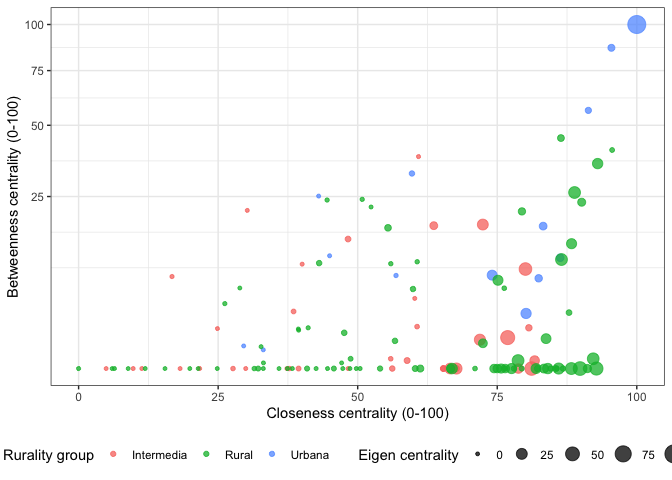

Territorial configuration of Colombian provinces
================

## 1\. Background project

This project contains the methods, algorithms and visualizations
employed by me and Dr. Juan Carlos Ramírez in the technical report
*Territorial configuration of Colombian provinces* (original title in
Spanish), published by ECLAC (Economic Commission for Latin America and
the Caribbean).

A first version of such document was published in 2017, and can be at
ECLAC’s [digital
repository](https://repositorio.cepal.org/handle/11362/40852). An
actualization is to be published in 2022.

## 2\. Motivation

This study aims to characterize and quantify a rurality measure for
Colombian provinces, and to use it to explore the rural-urban linkages
and the centrality measures of these territorial entities. The
Provincial Demographic Urbanization Index (IDUP, in Spanish) is
constructed via Principal Component Analysis (PCA). It derives into
three groups: urban, intermediate and rural. Ten refined categories of
rurality are defined combining the IDUP and the travel times by car
between the largest population seats.

For each province, its rurality category is an intrinsic function of its
demographic characteristics and its relationship with the most nearby
urban center. This single connection implies a reduced vision of
rural-urban relationships, which in general can encompass more complex
entanglements of territorial, economic and social relations. The
analysis of the complete network topology is necessary to define and
explore provinces’ centralities, and to estimate the impact of the
influence of other key territories. In total, 751 rural-urban linkages
are detected amongst Colombian provinces. The strength of each link is a
function of differences in the IDUP values and the spatial distance
between connected provinces.

In the network of rural-urban linkages different node centralities can
approximate measures of degrees of connection, intermediation, and
influence. This allow us to construct the categories of centrality, and
distinguish central provinces, isolated provinces, influencial
provinces, and ‘bridge’ provinces.

## 3\. Creating an index for rurality at the province level

``` r
# Packages to employ
library("dplyr")
## 
## Attaching package: 'dplyr'
## The following objects are masked from 'package:stats':
## 
##     filter, lag
## The following objects are masked from 'package:base':
## 
##     intersect, setdiff, setequal, union
library("ggplot2")
library("scales")

###########################################################################################
# INPUT DATA
###########################################################################################

# Demographic data on municipalities, from Colombia's census (2018), projected to 2021 
demo_m = read.csv2('data/population_by_municipality.csv',
                  header = TRUE, stringsAsFactors = FALSE)
head(demo_m)
##   Divipola codmun Departamento  Municipio   Total Cabecera Disperso Area
## 1     5001   5001    Antioquia   Medellín 2427129  2382399    44730  387
## 2     5002   5002    Antioquia  Abejorral   20367     7674    12693  497
## 3     5004   5004    Antioquia   Abriaquí    2695      824     1871  293
## 4     5021   5021    Antioquia Alejandría    4657     2485     2172  151
## 5     5030   5030    Antioquia      Amagá   30227    14184    16043   85
## 6     5031   5031    Antioquia     Amalfi   25962    14508    11454 1224
##     Altura  La    Lo
## 1 1479.810 6.2 -75.6
## 2 2157.152 5.8 -75.4
## 3 1992.240 6.6 -76.1
## 4 1631.778 6.4 -75.1
## 5 1402.970 6.0 -75.7
## 6 1553.321 6.9 -75.1

# Membership of every municipality to every province 
m_to_p = read.csv2('data/municipality_to_province.csv',
                  header = TRUE, stringsAsFactors = FALSE)  
head(m_to_p)  
##   codmun Municipio1 codpro            Provincia Departamento
## 1   5001   Medellin    100     Valle del Aburrá    Antioquia
## 2   5002  Abejorral     71               Sonsón    Antioquia
## 3   5004   Abriaqui     60            Occidente    Antioquia
## 4   5021 Alejandria     72             Represas    Antioquia
## 5   5030      Amaga     81 Penderisco-Sinifarná    Antioquia
## 6   5031     Amalfi     40             Nordeste    Antioquia

###########################################################################################
# AGGREGATED DATA
###########################################################################################

# Aggregate data to province level
datap = demo_m %>% 
  left_join(m_to_p, c('codmun'='codmun')) %>% # Join by municipality code
  group_by(codpro,Provincia) %>% summarise(
    # departamentos = paste0(unique(Departamento),collapse=", ")
    n_municipios = n_distinct(codmun), # number of municipalities
    pob_total = sum(Total), # Total population size
    pob_cabecera = sum(Cabecera), # Population size living in the municipal seat
    pob_disperso = sum(Disperso), # Population size living outside the municipal seat
    area = sum(Area), # Total area
    densidad_pob = sum(Total)/sum(Area), # Average population density
    imp_cabeceras = 100*sum(Cabecera)/sum(Total), # Avg. % of population living in the municipal seat
    max_cabeceras = max(Cabecera) # Population size on largest municipal seat
  )
## `summarise()` has grouped output by 'codpro'. You can override using the `.groups` argument.
datap = datap %>% 
  left_join(demo_m %>% # Joint province-level data with largest municipal seat identification
              dplyr::select(codmun,Municipio,Cabecera),
            c('max_cabeceras'='Cabecera'))
head(datap)
## # A tibble: 6 x 12
## # Groups:   codpro [6]
##   codpro Provincia       n_municipios pob_total pob_cabecera pob_disperso   area
##    <int> <chr>                  <int>     <int>        <int>        <int>  <dbl>
## 1     11 Leticia                    1     48144        33503        14641 5.83e3
## 2     12 Amazonía                  11     56913        16299        40614 1.14e5
## 3     20 Bajo Cauca                 6    248476       151954        96522 8.59e3
## 4     30 Magdalena Medio            7    150328        88381        61947 6.30e3
## 5     40 Nordeste                  10    196242       100021        96221 8.64e3
## 6     50 Norte                     17    241565       115475       126090 7.51e3
## # … with 5 more variables: densidad_pob <dbl>, imp_cabeceras <dbl>,
## #   max_cabeceras <int>, codmun <int>, Municipio <chr>

# Data to apply Principal Component Analysis on: log(population density) + 
# Avg. % of population living in the municipal seat + log(size of largest municipal seat)
data_pc = datap %>% mutate(log_densidad_pob = log(densidad_pob),
                          log_max_cabeceras = log(max_cabeceras)) %>% 
  dplyr::select(log_densidad_pob,imp_cabeceras,log_max_cabeceras)
## Adding missing grouping variables: `codpro`
head(data_pc)
## # A tibble: 6 x 4
## # Groups:   codpro [6]
##   codpro log_densidad_pob imp_cabeceras log_max_cabeceras
##    <int>            <dbl>         <dbl>             <dbl>
## 1     11            2.11           69.6             10.4 
## 2     12           -0.697          28.6              9.45
## 3     20            3.37           61.2             11.2 
## 4     30            3.17           58.8             10.4 
## 5     40            3.12           51.0             10.3 
## 6     50            3.47           47.8             10.3

###########################################################################################
# CREATE AN INDEX WITH PRINCIPAL COMPONENTS ANALYSIS
###########################################################################################

# Applying Principal Component Analysis
pc = prcomp(data_pc[,-1], center = TRUE, scale. = TRUE)
summary(pc) # The first component explains 77.1% of total variance
## Importance of components:
##                           PC1    PC2     PC3
## Standard deviation     1.5207 0.7048 0.43683
## Proportion of Variance 0.7708 0.1656 0.06361
## Cumulative Proportion  0.7708 0.9364 1.00000

# Standardized index:
# The Demographic Urbanization Index of Provinces
IDUP = 100*rescale(pc$x[,1])
datap$IDUP = IDUP

# This index is a linear combination of transform variables.
# Coefficients can be recovered with linear regression
coef(lm(IDUP~log(densidad_pob)+(imp_cabeceras)+log(max_cabeceras), datap))
##        (Intercept)  log(densidad_pob)      imp_cabeceras log(max_cabeceras) 
##        -46.3881553          4.1277568          0.3561608          4.8657238

#IDUP = -46.388 +4.128*log(densidad_pob) +0.356*imp_cabeceras +4.866*log(max_cabeceras) 

###########################################################################################
# CREATE THREE BROAD GROUPS OF RURALITY
###########################################################################################

# Using cutoff defined in previous methodology, 42--65, we divide provinces
# into three groups: urban, intermediate and rural
datap = datap %>% 
  mutate(grupo = case_when(IDUP > 65 ~ "Urbana",
                           IDUP < 42 ~ "Rural",
                           TRUE ~ "Intermedia"))

# Save the data frame
# write.csv2(datap %>% ungroup,'agg_provincias.csv')

# Histogram of The Demographic Urbanization Index of Provinces
datap %>% ggplot(aes(x=IDUP)) + 
  geom_histogram(fill="blue",bins = 40) +
  geom_vline(xintercept = 42, linetype="dashed", color = "red", size=1.5) +
  geom_vline(xintercept = 65, linetype="dashed", color = "red", size=1.5) + 
  annotate(geom="text", x=72, y=15, label="Urban ->", color="red") +
  annotate(geom="text", x=52, y=15, label="Intermediate ->", color="red") +
  annotate(geom="text", x=35, y=15, label="<- Rural", color="red") +
  theme_bw() + 
  labs(x='IDUP - Demographic Urbanization Index of Provinces',
       y='Count of provinces')
```


## 4\. Extracting distance and time-to-travel between provinces using Google Maps

To be able to extract the distance and time-to-travel between two
provinces in Colombia we employ the [Distance Matrix API service by
Google
Maps](https://developers.google.com/maps/documentation/javascript/distancematrix).
This requires creating a Google Developers account, registering a valid
credit card and requesting a private API key. *Do not worry\!* We will
not be charged if our data queries are below the limits:

  - 2,500 free elements per day, calculated as the sum of client-side
    and server-side queries.
  - Maximum of 25 origins or 25 destinations per request.
  - 100 elements per request.
  - 100 elements per second, calculated as the sum of client-side and
    server-side queries.

*We will set the queries to respect these limits to avoid being charged*
by constructing queries in a hierarchical and partitioned fashion.
First, distances/times to the largest municipality of each urban
province, which help us to create a further detailed set of rural/urban
categories; then to the largest municipality of each intermediate
province; and finally all the remaining pairwise connections.

``` r
# Packages to employ
library('gmapsdistance')
library('stringi')

# Setting your private API key for Google Maps Distance Matrix API service
# set.api.key("XXX")

###########################################################################################
###########################################################################################
# DISTANCE AND TIME-TO-TRAVEL TO URBAN PROVINCES
###########################################################################################
###########################################################################################

###########################################################################################
# INPUT DATA
###########################################################################################

datag = datap[,c(1,12)] %>% # Provinces info (rurality group)
  left_join(datam[,c(2:4)],c('codmun'='codmun')) %>% # Municipalities info (name, geo: lat, long)
  mutate(origin = gsub(' ','+', stri_trans_general( # Clean accents on municipalities and department  names
    paste(Municipio,Departamento,'Colombia'),id = "Latin-ASCII") # Combined name: municipality, department and Colombia
  ))

urb = c('Bogota+Colombia',datag$origin[2:14]) # Names of largest municipality of each urban province

###########################################################################################
# MAKE OPTIMAL SIZED QUERIES (TIME TO TRAVEL TO URBAN PROVINCES)
###########################################################################################

# Since there are 14 urban provinces, we need 19 queries against 7 origins and a remaining query
# To keep query size below 100 elements
requ = list()
for(k in 1:19){
  requ[[k]] = gmapsdistance(datag$origin[(k*7+8):(k*7+14)], 
                            destination = urb, mode = "driving")
  print(k)
  Sys.sleep(60) # Make a query past one minute, to not overload the API
}

# Last query of remaining size
requ[[20]] = gmapsdistance(datag$origin[148:150], 
                           destination = urb, mode = "driving")

# Extract all the distances and time-to-travel from queries' replies
timeUrb = requ[[1]]$Time
distanceUrb = requ[[1]]$Distance
for(k in 2:20){
  timeUrb = rbind.data.frame(timeUrb, requ[[k]]$Time)
  distanceUrb = rbind.data.frame(distanceUrb, requ[[k]]$Distance)
}

# Save data
write.csv2(timeUrb,'time_urbanas.csv')
write.csv2(distanceUrb,'distance_urbanas.csv')

###########################################################################################
# FEED A MORE DETAILED SET OF URBAN/RURAL CATEGORIES
###########################################################################################

datag = datag %>% # Identify to which province each 'nearest' urban setting belongs
  left_join(timeUrb %>% melt() %>% group_by(or) %>% summarise(nearest = min(value,na.rm = T)) %>%
              left_join(timeUrb %>% melt(), c('or'='or','nearest'='value')), c('origin'='or'))

# Turn time-to-travel from being mesured in seconds to hours  
datap$nearest.time = datag$nearest/(60^2)  
# Extract the name of the 'capital' of nearest urban province
datap$nearest.urb = gsub('.{1}$', '',str_match(datag$variable, "Time.\\s*(.*?)\\s*+Colombia")[,2])

# More detailed categories of rurality feed on time-to-travel to urban provinces
datap = datap %>% mutate(clase1 = case_when(
  grupo == 'Urbana' ~ '',
  is.infinite(nearest.time)  ~ 'Aislada', # Isolated
  nearest.time <= 2.03 & grupo != 'Urbana' ~ 'Periurbana', # Peri-urban
  nearest.time > 2.03 & nearest.time <= 4 & grupo == 'Intermedia' ~ 'Cercana', # (Pending)
  nearest.time > 2.03 & nearest.time <= 4 & grupo == 'Rural' ~ 'Cercana a Urbana', # Close to urban
  nearest.time > 4 & grupo == 'Intermedia' ~ 'Alejada', # Far away
  nearest.time > 4 & grupo == 'Rural' ~ 'X', # (Pending)
))

datag$clase1 = datap$clase1

###########################################################################################
###########################################################################################
# DISTANCE AND TIME-TO-TRAVEL TO INTERMEDIATE PROVINCES
###########################################################################################
###########################################################################################

# Identify intermediate provinces and rural without a detailed category
int = datag %>% filter(clase1=='Cercana') %>% pull(origin)
rur = datag %>% filter(clase1=='X') %>% pull(origin)

###########################################################################################
# MAKE OPTIMAL SIZED QUERIES (TIME TO TRAVEL TO INTERMEDIATE PROVINCES)
###########################################################################################

# There are 13 intermediate (cercanas) provinces and 35 rural (X) provinces.
# We need 5 queries against 7 origins and a remaining query o keep query size below 100 elements
requ1 = list()
for(k in 1:5){
  requ[[k]] = gmapsdistance(rur[(1+7*(k-1)):(7*k)], 
                            destination = int, mode = "driving")
  print(k)
  Sys.sleep(60) # Make a query past one minute, to not overload the API
}

# Extract all the distances and time-to-travel from queries' replies
timeInt = requ[[1]]$Time
distanceInt = requ[[1]]$Distance
for(k in 2:5){
  timeInt = rbind.data.frame(timeInt, requ[[k]]$Time)
  distanceInt = rbind.data.frame(distanceInt, requ[[k]]$Distance)
}

# Save data
write.csv2(timeInt,'time_intermedias2.csv')
write.csv2(distanceInt,'distance_intermedias2.csv')

###########################################################################################
# FEED A MORE DETAILED SET OF URBAN/RURAL CATEGORIES
###########################################################################################

datag = datag %>% # Identify to which province each 'nearest' intermediate setting belongs
  left_join(timeInt %>% melt() %>% group_by(or) %>% summarise(nearint = min(value,na.rm = T)) %>%
              left_join(timeInt %>% melt(), c('or'='or','nearint'='value')), c('origin'='or'))

# Turn time-to-travel from being mesured in seconds to hours  
datap$nearint.time = datag$nearint/(60^2)   
# Extract the name of the 'capital' of nearest urban province
datap$nearest.int = gsub('.{1}$', '',str_match(datag$variable.y, "Time.\\s*(.*?)\\s*+Colombia")[,2])

# More detailed categories of rurality feed on time-to-travel to intermediate provinces
datap = datap %>% mutate(clase2 = case_when(
  is.na(nearint.time) ~ clase1, # Keep previous categories
  nearint.time <= 4 ~ 'Cercana a Intermedia', # Close to intermediate
  nearint.time > 4 ~ 'Alejada', # Far away
))

# Save complete categories
datag$clase1 = datap$clase1
write.csv(datap %>% ungroup,'clasificacion_completa2.csv')
```

## 5\. Spatial network configuration of Colombian provinces

``` r
# iGraph package for network analysis
library('igraph')
## 
## Attaching package: 'igraph'
## The following objects are masked from 'package:dplyr':
## 
##     as_data_frame, groups, union
## The following objects are masked from 'package:stats':
## 
##     decompose, spectrum
## The following object is masked from 'package:base':
## 
##     union

#############
# INPUT DATA
#############

# This matrix contains the distance of every province to every other one in terms of 
# time to travel (in sec.) by principal road form largest seat to largest seat: t(i,j)
# It is not defined by pairs of provinces on the same group (urban, intermediate, rural)
matriz.t = read.csv2('data/graph-matrix-distance.csv',header=T)

# This matrix contains the absolute difference of every province to every other one 
# in terms of their Demographic Urbanization Index: abs(IDUP_i - IDUP_j)
# It is not defined by pairs of provinces on the same group (urban, intermediate, rural)
matriz.f = read.csv2('data/graph-matrix-difference.csv',header=T)

# There are provinces that are isolated by road, or > 7h to a urban/intermediate city
exclude = c(16,70,72,95,124,133,138,140,145,147,148,76,105,118,150)

# Excluding isolated provinces from distance matrices
m.t = matriz.t[-exclude,-(8+exclude)]
m.t[is.na(m.t)] = 0
m.f = matriz.f[-exclude,-(8+exclude)]
m.f[is.na(m.f)] = 0

##########################
# CENTRALITY MEASURES
##########################

# Graph 1 in which weights are given by spatial distances
ig.t = graph.adjacency(as.matrix(m.t[,9:143]), mode="undirected", weighted=TRUE)
# Graph 2 in which weights are given by differences in IDUP
ig.f = graph.adjacency(as.matrix(m.f[,9:143]), mode="undirected", weighted=TRUE)

# Data frame with node-wise information
node_data = m.t[,1:8]

# Centrality #0 -- Degree centrality
dgr = degree(
  ig.t,
  v = V(ig.t),
  loops = FALSE,
  normalized = FALSE)

node_data$degree = dgr

# The rural-urban gradient is defined as the absolute difference on IDUP divided 
# over the time to travel (in hours) between the two largest municipal seats
# It can be interpreted as the force of interaction between to provinces
gradient = (E(ig.f)$weight)/(E(ig.t)$weight/(60^2))

# Centrality #1 -- Closeness centrality (in 0-100 scale)
clo = closeness(
  ig.t,
  vids = V(ig.t),
  normalized = TRUE,
  weights = 1/gradient # The weights here are interpreted as costs or distances
)

node_data$closeness.scale = 100*(clo-min(clo))/(max(clo)-min(clo))

# Centrality #2 -- Betweenness centrality (in 0-100 scale)
bet = betweenness(
  ig.t,
  v = V(ig.t),
  directed = FALSE,
  normalized = TRUE,
  weights = 1/gradient # The weights here are interpreted as costs or distances
)

node_data$betweenness.scale = 100*(bet-min(bet))/(max(bet)-min(bet))

# Centrality #3 -- Eigenvalue centrality (in 0-100 scale)
eig = eigen_centrality(
  ig.t,
  scale = TRUE,
  options = arpack_defaults,
  weights = gradient # The weights here are interpreted as forces
)

node_data$eigen.scale = 100*(eig$vector-min(eig$vector))/(max(eig$vector)-min(eig$vector))

# A glimpse on centrality measures of provinces
head(node_data)
##   codpro        Provincia              departamentos codmun    Municipio
## 1    170           Bogotá Bogotá, D.C., Cundinamarca  11001 Bogotá, D.C.
## 2    100 Valle del Aburrá                  Antioquia   5001     Medellín
## 3    130            Norte                  Atlántico   8001 Barranquilla
## 4   1390              Sur            Valle del Cauca  76001         Cali
## 5   1060          Oriente         Norte de Santander  54001       Cúcuta
## 6    190            Dique                    Bolívar  13001    Cartagena
##         IPU  grupo            clase degree closeness.scale betweenness.scale
## 1 100.00000 Urbana    Metropolitana     35       100.00000       100.0000000
## 2  92.10664 Urbana    Metropolitana     20        95.45357        86.9095816
## 3  91.21812 Urbana    Metropolitana     16        43.00506        25.1282051
## 4  83.25917 Urbana    Metropolitana     11        59.71955        32.1457490
## 5  78.14630 Urbana No metropolitana      6        56.86389         7.3144399
## 6  76.05419 Urbana No metropolitana     18        29.57199         0.4318489
##    eigen.scale
## 1 1.000000e+02
## 2 4.893499e+00
## 3 9.658698e-03
## 4 1.260874e+00
## 5 1.181308e-01
## 6 5.881159e-03

node_data %>% 
  ggplot(aes(x=closeness.scale, y=betweenness.scale,
             color=grupo, size=eigen.scale)) +
  geom_point(alpha=0.75) +
  scale_y_sqrt() + theme_bw() +
  labs(x='Closeness centrality (0-100)',y='Betweenness centrality (0-100)') +
  guides(color=guide_legend(title="Rurality group"),
         size=guide_legend(title='Eigen centrality')) + 
  theme(legend.position='bottom')
```



``` r
##########################
# NETWORK PLOTS
##########################

# Geographic position of Colombian municipalities
geo = read.csv2('data/geo_position.csv',header=T) %>% 
  dplyr::select(codmun,La,Lo)

# Add geographic position of largest municipal seat to data
node_data = node_data %>% left_join(geo,'codmun')

# Network layout accordint to geo position
lay = norm_coords(cbind(node_data$Lo,node_data$La),
                  ymin=-1, ymax=1, xmin=-1, xmax=1)

# Assign a color depening on rurality group
colrs <- c('#b8d86c','#6cb8d8','#d86cb8')
colo = c()
for(i in 1:135){
  colo[i] = ifelse(node_data$grupo[i]=='Urbana',colrs[1],
                   ifelse(node_data$grupo[i]=='Rural',colrs[3],colrs[2]))
  }

# Adapt node labels
labels = gsub("\\.", " ", V(ig.t)$name)
labels = gsub("1", "", labels)
labels[1] = '       Bogotá'
labels[69] = 'Tumaco'

# Plot network
par(omi=c(0,0,0,0), mgp=c(0,0,0),mar=c(0,0,0,0) , family = "D")
par(mfrow=c(1,1),cex=1,cex.lab = 0.5,cex.main=0.2,cex.axis=0.2)
plot(ig.t, 
     edge.arrow.size=0,
     edge.color= 'dimgray',
     vertex.size=sqrt(node_data$IPU)/3, # Radius of node proportional to IDUP
     edge.width=(gradient)^0.8/18,  # Width is a function of gradient
     layout=lay,
     rescale=FALSE,
     vertex.shape="circle",
     vertex.label=labels,
     vertex.label.cex=0.45,
     vertex.label.dist=0.3,
     vertex.label.degree=-pi/2,
     vertex.color=colo,
     vertex.frame.color=colo,
     vertex.label.family="Helvetica")
```


``` r

# Plot network in circular layout
la = layout.circle(ig.t)
x = la[,1]*1.1
y = la[,2]*1.1
angle = ifelse(atan(-(la[,1]/la[,2]))*(180/pi) < 0, 
               90 + atan(-(la[,1]/la[,2]))*(180/pi),
               270 + atan(-la[,1]/la[,2])*(180/pi))
labels[1] = 'Bogotá'

par(omi=c(0,0,0,0), mgp=c(0,0,0),mar=c(0,2,0,2) , family = "D")
par(mfrow=c(1,1),cex=1,cex.lab = 0.5,cex.main=0.2,cex.axis=0.2)
plot(ig.t, 
     edge.arrow.size=0,
     edge.color= 'dimgray',
     vertex.size=sqrt(node_data$IPU)/3, # Radius of node proportional to IDUP
     edge.width=(gradient)^0.8/18,  # Width is a function of gradient
     layout=la,
     rescale=FALSE,
     vertex.shape="circle",
     vertex.label=NA,
     vertex.label.cex=NA,
     vertex.label.dist=0.5,
     vertex.label.degree=NA,
     vertex.color=colo,
     vertex.frame.color=colo)
for (i in 1:length(x)) {
  text(x=x[i], y=y[i], labels=labels[i], adj=NULL, pos=NULL, cex=.5, srt=angle[i],
       xpd=T, family = "Helvetica")
}
```


